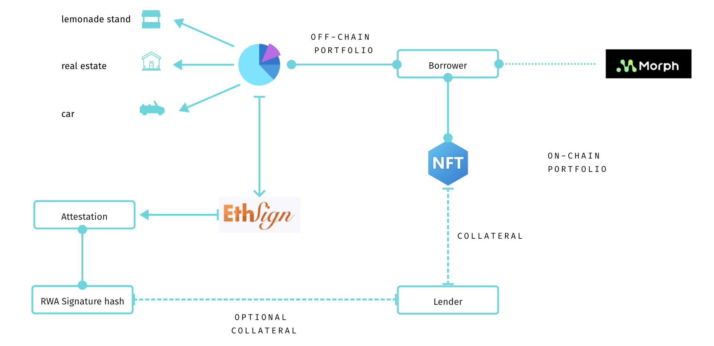

# Nectar Finance

## Overview
Nectar Finance is an innovative lending platform developed on the Morph Testnet using Scaffold ETH. Our platform uses NFTs as collateral, including the integration of partial real-world assets (RWAs) through signed agreements. This unique feature bridges the gap between digital and tangible assets, offering secure financing options and improved liquidity.

Visit us live at: [Nectar Finance](https://nectarfinance.vercel.app/)

## Key Features
- **NFTs as Collateral**: Utilize both digital and real-world assets as collateral for loans.
- **Real-World Asset Integration**: Enhance collateral options with legally enforceable signed agreements for partial RWAs.
- **Platform Security and Efficiency**: Utilize ETHSign for secure digital signing of agreements, ensuring all transactions are transparent and tamper-proof.
- **Scaffold on Morph Testnet**: Develop and deploy using the efficient and adaptable Scaffold ETH toolkit on the Morph Testnet.

## Technology Stack
- **Blockchain Platform**: Morph Testnet
- **Framework**: Scaffold ETH
- **Smart Contracts**: Solidity
- **Digital Signing**: ETHSign for secure agreements
- **Data Handling**: Powerloom for accurate and decentralized data verification
- **Tokens**: ERC-20 for loans, ERC-721 for asset collateralization

## Our Ethos
At Nectar Finance, we are deeply committed to innovation, continuously enhancing the functionality and usability of our lending platform by integrating advanced blockchain technologies.

- **Consumer Centric Solutions**: Focused on developing blockchain-based applications that meet everyday user needs, such as loyalty systems and NFT ticketing platforms.
- **Innovative Use of NFTs and RWAs**: Pioneering the use of NFTs linked to real-world assets to provide a solid foundation for secure and transparent financial transactions.
- **Integration with Powerloom**: Incorporating Powerloom technology to build sophisticated front-end solutions that manage real-time data efficiently.
- **Enhancing Security with ETHSign**: Revolutionizing how agreements are signed and verified, improving accessibility and security for all transactions.

## Architecture and Attestations
Below is an overview of the Nectar Finance system architecture, illustrating how different components interact within our platform:

### Attestation of Real-World Assets
Nectar Finance leverages ETHSign to generate digital attestations that serve as proof of ownership for borrowers' RWAs. These attestations are crucial for validating that a borrower possesses the RWAs claimed in their portfolio, which can be used as collateral. This process involves:

- **Verification of Asset Ownership**: Borrowers provide evidence of their RWAs, which is verified by our platform.
- **Creation of a Digital Attestation**: Once verified, a digital attestation is created using ETHSign. This attestation certifies the ownership and eligibility of the RWAs for use as collateral.
- **Blockchain Recording**: The attestation is recorded on the blockchain, providing a tamper-proof and immutable record that can be accessed and verified by lenders.

This attestation mechanism ensures that all collateral used in our lending process is verified and secure, enhancing trust and reducing risk for lenders.

## Getting Started
To engage with Nectar Finance:
1. **Collateralize Your Assets**: Convert your NFTs or RWAs into collateral.
2. **Secure a Loan**: Apply for loans backed by your collateralized assets.
3. **Loan Management**: Manage and repay your loans efficiently using our platform.

## Setting Up
For full utilization of Powerloom and ETHSign:
- **Powerloom Integration**: Configure a Snapshotter node or utilize the API to manage real-time data from RWAs.
- **ETHSign Usage**: Implement ETHSign for all agreement signings to ensure heightened security and enforceability.

## Support and Community
For support, contact us at [support@netcarfinance.com](mailto:support@netcarfinance.com) or join our Discord community at [Discord](<DISCORD_LINK>).

## Contributing
Interested in contributing? Check our [contributing guidelines](<LINK_TO_CONTRIBUTING_GUIDELINES>).

## License
Nectar Finance is open-sourced under the MIT license.
