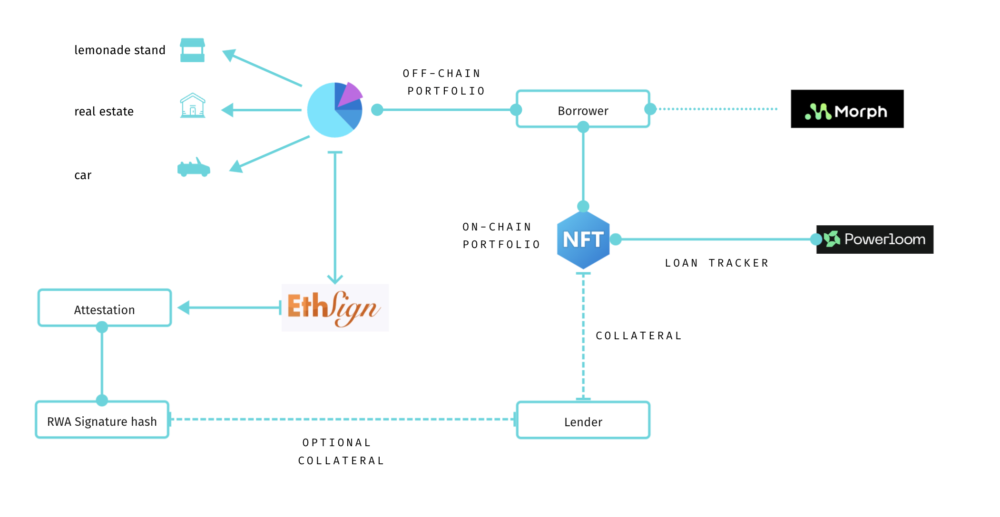
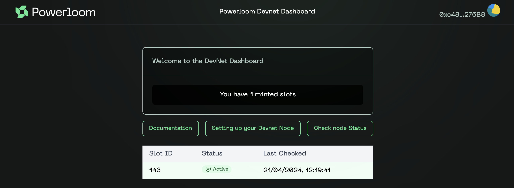

# Nectar Finance

## Overview
Nectar Finance is an innovative lending platform developed on the Morph Testnet using Scaffold ETH. Our platform uses NFTs as collateral, integrating partial real-world assets (RWAs) through legally enforceable signed agreements. This feature bridges digital and tangible assets, providing secure financing options and enhanced liquidity.

Visit us live at: [Nectar Finance](https://nectarfinance.vercel.app/)

## Key Features
- **NFTs as Collateral**: Leverage both digital and real-world assets for loans.
- **Real-World Asset Integration**: Use legally enforceable signed agreements to enhance collateral options.
- **Platform Security and Efficiency**: Utilize ETHSign for secure digital signing of agreements, ensuring transaction transparency and tamper-proofing.
- **Scaffold on Morph Testnet**: Develop and deploy with the adaptable Scaffold ETH toolkit on the Morph Testnet.

## Technology Stack
- **Blockchain Platform**: Morph Testnet
- **Framework**: Scaffold ETH
- **Smart Contracts**: Solidity
- **Digital Signing**: ETHSign for secure agreements
- **Data Handling**: Powerloom for precise, decentralized data verification
- **Tokens**: ERC-20 for loans, ERC-721 for asset collateralization

## Our Ethos
At Nectar Finance, our commitment to innovation is deeply ingrained, enhancing our lending platform's functionality and usability by integrating advanced blockchain technologies:

- **Consumer Centric Solutions**: Creating blockchain-based applications that cater to everyday user needs.
- **Innovative Use of NFTs and RWAs**: Using NFTs linked to real-world assets to secure and transparent financial transactions.
- **Integration with Powerloom**: Building sophisticated front-end solutions that efficiently manage real-time data.
- **Enhancing Security with ETHSign**: Revolutionizing agreement signing and verification, improving accessibility and security for all transactions.

## Architecture and Integration with Powerloom

Below is an overview of the Nectar Finance system architecture, illustrating how different components interact within our platform:

### Integration with Powerloom

#### Contribution to Powerloom Repositories

We have contributed to Powerloom repositories by forking 2 repos and making 2 pull requests necessary to customize the deploy repo with custom configs + modules

- **Pull Requests**:

- [Snapshotter Configs PR #3](https://github.com/PowerLoom/snapshotter-configs/pull/3): Introduces new configuration entries for Nectar Finance's NFT loan and collateral monitoring services.
- [Snapshotter Computes PR #9]([https://github.com/PowerLoom/snapshotter-computes/pull/9]): Adds compute modules designed to track and process data concerning NFT loans and the status of NFTs as a collateral. 

Nectar Finance utilizes Powerloom technology to ensure accurate and decentralized verification of RWA data in real-time. This integration plays a critical role in enhancing the platform's ability to manage and verify collateral effectively.

**Powerloom's Role in Nectar Finance:**

- **Snapshotter Node Configuration**: We have configured Snapshotter nodes specific to our needs, which continuously capture and record blockchain events related to NFTs and collateral assets.
- **Real-Time Data Handling**: Snapshotter nodes process data in real-time, ensuring all user transactions and interactions are captured accurately and immutably.
- **Enhanced Data Verification**: The use of Powerloom enhances the security and reliability of data used in loan assessments and risk management.

### Attestation of Real-World Assets

We generate digital attestations for RWAs using ETHSign, providing proof of ownership essential for collateral validation. This process enhances transparency and security, ensuring all parties are protected and risks are minimized.

## Getting Started

1. **Collateralize Your Assets**: Turn your NFTs or RWAs into collateral.
2. **Secure a Loan**: Apply for loans backed by your collateral.
3. **Loan Management**: Manage and repay your loans using our platform.

## Support and Community

For support, contact us at [support@nectarfinance.com](mailto:support@nectarfinance.com) or join our Discord community at [Discord](<DISCORD_LINK>).

## Contributing

Interested in contributing? Review our [contributing guidelines](<LINK_TO_CONTRIBUTING_GUIDELINES>).

## License

Nectar Finance is open-sourced under the MIT license.
